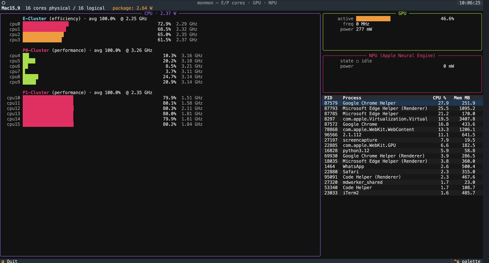

# monmon

A terminal UI for watching Apple Silicon work: efficiency cores, performance
cores, GPU, and the Neural Engine (NPU) — plus the top processes driving load.

<p align="center">
  
</p>

> **One-shot build note**: this entire project was generated in a single pass
> by **Claude Opus 4.7 (1M context)** running in Claude Code, from the prompt
> shown at the bottom of this README. No manual edits were made before the
> first successful run.

## Requirements

- macOS on Apple Silicon (M1 or newer)
- Python 3.12+
- [uv](https://github.com/astral-sh/uv)
- `sudo` access (Apple's `powermetrics` requires root)

## Install / run

### Homebrew (recommended for users)

```sh
brew install gavi/monmon/monmon
monmon
```

### From source (for development)

```sh
uv sync
uv run monmon
```

You'll be prompted for your password once — `sudo` caches it for the session
and `powermetrics` is spawned under `sudo -n` so it never blocks the TUI.

Optional flags:

```sh
uv run monmon --interval 500   # 500 ms samples (default: 1000)
```

Quit with `q` or `ctrl-c`.

## What you see

- **CPU panel**: every E-core and P-core cluster with per-core active-residency
  bars and current frequency. E-clusters render in cyan, P-clusters in magenta.
- **GPU panel**: active residency, frequency, and power draw.
- **NPU panel**: Apple Neural Engine power. `powermetrics` doesn't expose an
  "active" counter for ANE, so monmon treats any non-trivial power draw as
  "in use" and scales the bar against an 8 W ceiling.
- **Process table**: top processes by CPU from `psutil`. (powermetrics' task
  sampler is unreliable across macOS versions, so we use psutil for the
  "what's running?" view.)

## Data source

Everything above comes from a single `powermetrics -f plist` stream with the
`cpu_power`, `gpu_power`, and `ane_power` samplers. Samples are NUL-delimited
XML plists; see `src/monmon/power.py` for the parser.

## Origin prompt

This is the exact prompt that produced the project, verbatim:

```
lets build a mac monitoring system that shows gpu
lets use
uv for package management and tui
we need to see e-cores and p-cores and also gpu and npu to see what is being run
go ahead a build it
```

Model: **Claude Opus 4.7 (1M context)** via Claude Code. One-shot — the only
follow-up was a cosmetic request to add this section and a `CLAUDE.md`.
